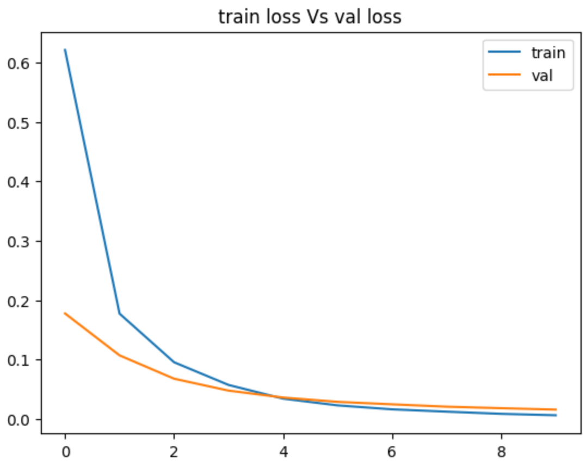
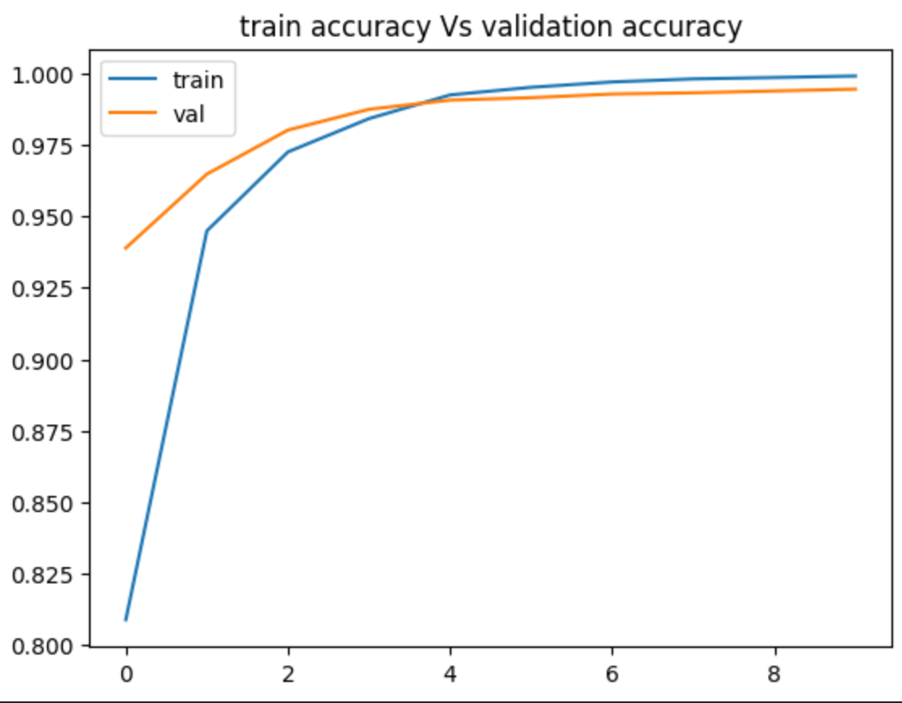
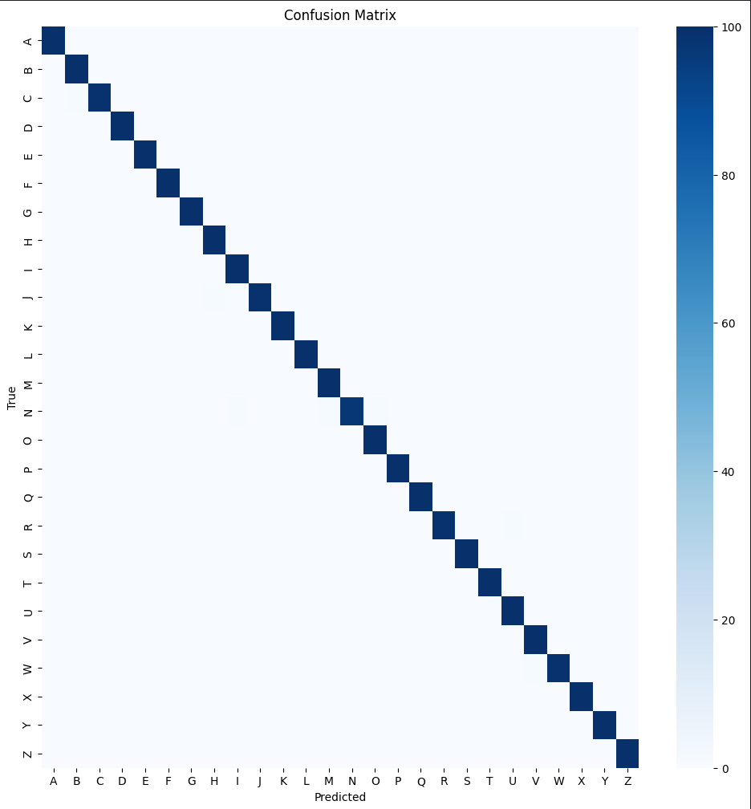
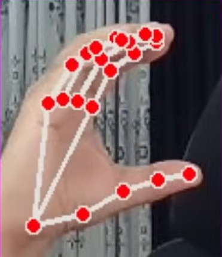
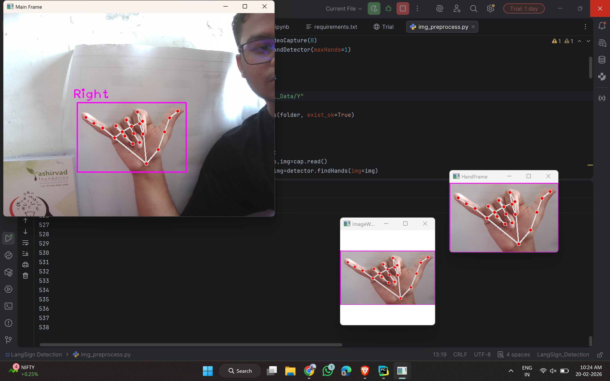

# Sign-Bridge AI — Real-Time Sign Language Translation System

> End-to-end AI pipeline that translates American Sign Language gestures into text, speech, and 17+ languages — live, in the browser.
> small-note : some lagging in the web could be there because of the free tier AWS instance my model alone takes 512 MB's of RAM if we use bigger one this issue will be solved as the project level you can ignore the lagging as of now this is the consideration from my side

[](https://www.python.org/downloads/release/python-3100/)
[](https://www.tensorflow.org/api_docs/python/tf/keras)
[](https://arxiv.org/abs/1801.04381)
[](https://mediapipe.readthedocs.io/en/latest/solutions/hands.html)
[](https://fastapi.tiangolo.com/)
[](https://aws.amazon.com/ec2/)

---

## Live Demo(Linkedin post with Live working Video)

-> [Click here to view the live working & project's url](https://www.linkedin.com/feed/update/urn:li:activity:7432050087935107072/)

---
## Problem Statement

Communication barriers between the hearing-impaired community and the rest of the world remain a major unsolved challenge. Sign-Bridge AI bridges that gap using real-time computer vision and deep learning — no specialist hardware, no delay, no dependency on another person.

The system stratifies hand gestures (ASL — American Sign Language) into characters, builds words and sentences, applies NLP correction, translates into 17+ languages, and speaks the output aloud. All of this runs live in the browser, cloud-hosted on AWS EC2.

---

## Pipeline

```
Browser Camera (getUserMedia API)
        │
        ▼
WebSocket Frame Stream  (/ws/camera)
        │
        ▼
MediaPipe Hands  ──► Landmark Extraction (21 × 3 = 63 points)
        │
        ▼
MobileNetV2 Classifier  (fine-tuned layers 100–155)
        │
        ▼
Smoother + Hold Tracker  ──► Letter / Special Gesture Confirmed
        │
        ▼
SentenceBuilder  ──► Word Suggestions (NLTK Brown Corpus Bigrams)
        │
        ▼
NLP Autocorrect  ──► SpellChecker + LanguageTool Pipeline
        │
        ▼
Multilingual Translation  ──► deep-translator (GoogleTranslator)
        │
        ▼
gTTS Cloud TTS  ──► base64 MP3 streamed back via WebSocket → Browser Audio
```

---

## Key Features

- **Real-time gesture recognition** — camera frames streamed to server, annotated JPEG returned via WebSocket
- **WhatsApp-style word suggestions** — NLTK Brown Corpus bigram model with Q–T keyboard shortcuts
- **NLP autocorrect pipeline** — SpellChecker + LanguageTool, 5 correction variants (Title / Sentence / CAPS / lower / Polished)
- **17+ language translation** — Hindi, Gujarati, Spanish, French, Arabic, Chinese, Japanese, Korean, and more
- **Cloud TTS with gTTS** — no OS dependency, works on any cloud server; audio streamed as base64 MP3
- **Special gesture commands** — Flat Hand (SPACE), Pinch (End + Speak), Thumbs Up (Autocorrect)
- **Custom training dataset** — built from scratch using OpenCV; no public ASL dataset used
- **Cloud-ready architecture** — deployed on AWS EC2, domain via DuckDNS, zero desktop dependency

---

## FineTunning Part(Model Architecture)

| Component | Detail |
|---|---|
| Base Model | MobileNetV2 |
| Fine-Tuned Layers | 100 – 155 |
| Input Shape | 128 × 128 × 3 |
| Feature Vector | n = 1280 (GlobalAveragePooling) |
| Output Classes | A–Z + SPACE + DOT + AUTOCORRECT (29 total) |
| Classifier Head | Dense → Dropout → Softmax |
| Hand Detector | MediaPipe Hands (max 1 hand, complexity 1) |

### Inference Settings

| Parameter | Value |
|---|---|
| Confidence Threshold | 0.75 |
| Smoothing Window | 10 frames |
| Letter Hold Duration | 1.0 sec |
| Special Gesture Hold | 1.2 sec |
| Letter Cooldown | 1.5 sec |
| WebSocket Frame Rate | Adaptive (request-reply loop) |

---

## Dataset

**Custom dataset — built by the author using OpenCV.**
No existing public ASL image dataset was used. Each class was captured from live webcam sessions, normalized, and labelled manually.

| Feature | Description |
|---|---|
| Landmark Input | 21 hand keypoints × (x, y, z) = 63-float vector |
| Normalization | Centered on wrist (landmark 0), max-abs scaled |
| Classes | A–Z alphabets + SPACE + DOT + AUTOCORRECT |
| Augmentation | Real-time variation (lighting, angle, distance) |

Reference dataset for validation:
[UCI — Gesture Phase Segmentation Dataset](https://archive.ics.uci.edu/dataset/302/gesture+phase+segmentation)

---

## Special Gesture Commands

| Gesture | Action | Hold |
|---|---|---|
| ✋ Flat Hand | Insert SPACE between words | 1.2 sec |
| 🤏 Pinch | End sentence + speak aloud | 1.2 sec |
| 👍 Thumbs Up | Trigger NLP autocorrect | 1.2 sec |
| Q – T keys | Select word suggestion 1–5 | — |
| 1 – 5 keys | Pick autocorrect variant | — |
| Z / Backspace | Delete last letter or restore last word | — |
| C key | Clear all text | — |

---

## Tech Stack

| Layer | Technology |
|---|---|
| Language | Python 3.10 |
| ML Framework | TensorFlow / Keras |
| Vision Model | MobileNetV2 (fine-tuned) |
| Hand Tracking | MediaPipe Hands |
| Image Processing | OpenCV Headless |
| Backend | FastAPI + Uvicorn |
| Real-time Comms | WebSocket (binary frame streaming) |
| NLP | SpellChecker + LanguageTool (`en-US`) |
| Word Suggestions | NLTK Brown Corpus (unigram + bigram) |
| Translation | deep-translator (GoogleTranslator) |
| TTS | gTTS (Cloud, base64 MP3) |
| Frontend | Vanilla HTML/CSS/JS (served by FastAPI) |
| Camera API | Browser `getUserMedia` |
| Cloud | AWS EC2 t3.small |
| Domain | DuckDNS |

---

## Project Structure

```
sign-bridge-ai/
├── predict_api_v2.py          # FastAPI backend — all inference, WS, TTS, translation
├── asl_landmark_model.keras   # Trained MobileNetV2 model
├── label_encoder.json         # Class name list (A–Z + specials)
├── word_suggester_cache.pkl   # Pre-built NLTK bigram cache
├── static/
│   ├── sign_languages.png     # ASL alphabet reference chart
│   └── model_architecture.png # MobileNetV2 architecture diagram
├── environment.yml            # Conda environment (all dependencies)
└── README.md
```

---

## Quickstart

```bash
# Clone repository
git clone https://github.com/YOUR_USERNAME/sign-bridge-ai.git
cd sign-bridge-ai

# Create conda environment
conda env create -f environment.yml
conda activate sign-bridge-ai

# Run server
uvicorn predict_api_v2:app --host 0.0.0.0 --port 8000
```

Then open `http://localhost:8000` in your browser.

> **Note:** If `0.0.0.0:8000` does not resolve, use `http://localhost:8000` instead (DNS resolution issue on some systems).

---

## Cloud Architecture

```
User Browser
    │  getUserMedia (camera frames)
    │
    ▼
WebSocket /ws/camera  ──► FastAPI (AWS EC2 t3.small)
    │                          │
    │                    MediaPipe + TF inference
    │                          │
    ◄── annotated JPEG ────────┘

WebSocket /ws  ──► state push (live text, suggestions, translation, status)

POST /command       ──► button actions (space, dot, backspace, clear, pick)
POST /translate     ──► async deep-translator thread
POST /speak_translation ──► gTTS → base64 MP3 → WS broadcast → browser Audio()
```

---

## Results / Performance

| Metric | Value |
|---|---|
| Gesture Classes | 29 (A–Z + SPACE + DOT + AUTOCORRECT) |
| Languages Supported | 17 |
| TTS Latency | ~1–2 sec (gTTS cloud round-trip) |
| Inference Latency | Adaptive (frame rate limited by EC2 t3.small CPU) |
| Deployment | AWS EC2 t3.small — public access via DuckDNS |

> **Note on latency:** Frame lag on the live demo is a resource constraint (t3.small CPU), not a model or code issue. On a compute-optimised instance (e.g. c5.xlarge with GPU), the pipeline runs without perceptible delay.

---

## Application Areas

- **Government service desks** — enable non-speaking citizens to communicate directly with officials
- **Healthcare** — patient intake and consultation for hearing-impaired individuals
- **Education** — real-time ASL-to-text for classroom inclusion
- **Broadcasting** — live captioning and translation for deaf-accessible TV/streaming
- **Any setting** where non-speaking people interact with the general public

---

## Roadmap

- [ ] GPU-accelerated inference (ONNX Runtime / TFLite) for sub-100ms latency
- [ ] Multi-hand support (two-hand sign detection)
- [ ] ISL (Indian Sign Language) model alongside ASL
- [ ] Sentence-level contextual correction (transformer-based LM)
- [ ] Mobile app wrapper (PWA or React Native)
- [ ] SHAP-based gesture attribution for model interpretability

---

Here is the some key constrainsts about my project "Sign-Bridge AI" : 

## 1. What Problems it solved?
---> so basically we aolving the comunication gap between the Non-Speaking and the Speaking(Or we can say Normal people who has ability to speak) by using this software they can communicate with each other, here the another thing is i have added the multi-lingustic feature that can help to ASL(American Sign Language to any language around the Globe).

## 2.Application Areas : 
---> we can integrate this thing with the Goverment Sevelent Area where any Deaf is there that can easily communicate with the around the people , TV channels for Deaf is can be accesibe for the Normal people by using this , i think no limitation we will intergrate this thing in the every plcae where the Deaf people is operation 

## 3.Why i make this project?
---> here the goal is simple to help those people that is lacking because they does not have the voice so that is the major reason to devlop this project

## 4.What is unique than others?
---> In the LinkedIn or the any platform i can found this type of the "sign language detection models" but i think to go beyond that and i have added the additional functionality it means end-to-end communication pipeline (HandSign -> detection -> speak -> in multilanguage support ). so this thing is uniqly made by my own idea and creation  

## 5.What Domain expertise that i have put in this project ? 
---> Be honest with your self i have put all the topics that i learned before like LLM(Mobile-Net-V2) , Finetunning(100-155 layers till i fune tunned) , for the sentence suggestion i use the NLP(text processing -> prediction) , OpenCV(image capturing and the image preprocessing) , web sockets (frames are not lagging by using this) , Speech modules (for speaking in the multi-language)

## 6.Which platform i use to deploy this project?
---> I used the AWS -> EC2 -> t3-small-instance for deploying 

<h2>📸 Project Screenshots</h2>

<h3>Train Vs Val Loss</h3>


<h3>Train Vs Val Accuracy</h3>


<h3>Confusion Matrix</h3>


<h3>Translation Feature</h3>


<h3>Custom Dataset Creation</h3>


---

## Citation / References

If you use this project or the architecture as a reference, please cite:

```
@misc{signbridge2025,
  author       = {Aksh Bhimani},
  title        = {Sign-Bridge AI: Real-Time ASL Translation with MobileNetV2 and MediaPipe},
  year         = {2025},
  howpublished = {\url{https://lnkd.in/dzduZgGi}},
  note         = {Cloud Edition — AWS EC2, FastAPI, gTTS, LanguageTool NLP}
}
```

Related references:

- Howard, A. G. et al. (2017). *MobileNets: Efficient Convolutional Neural Networks for Mobile Vision Applications.* [arXiv:1704.04861](https://arxiv.org/abs/1704.04861)
- Lugaresi, C. et al. (2019). *MediaPipe: A Framework for Building Perception Pipelines.* [arXiv:1906.08172](https://arxiv.org/abs/1906.08172)
- Rothe, A. et al. *LanguageTool: Open Source Grammar and Spell Checker.* [languagetool.org](https://languagetool.org)
- UCI Machine Learning Repository — [Gesture Phase Segmentation Dataset](https://archive.ics.uci.edu/dataset/302/gesture+phase+segmentation)
